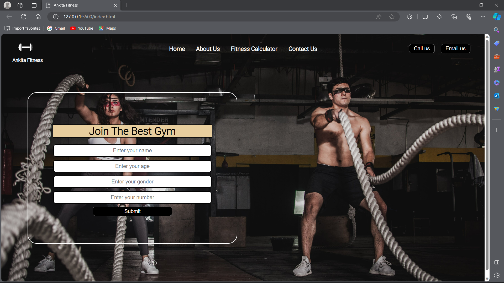

# GymWebsite
A simple gym website using just HTML5 and CSS3
A static website is made using simple concepts of HTML and CSS like, HTML form, CSS display property, position property, simple margin and padding, hover effect etc.

Here is the preview of GymWebsite :

